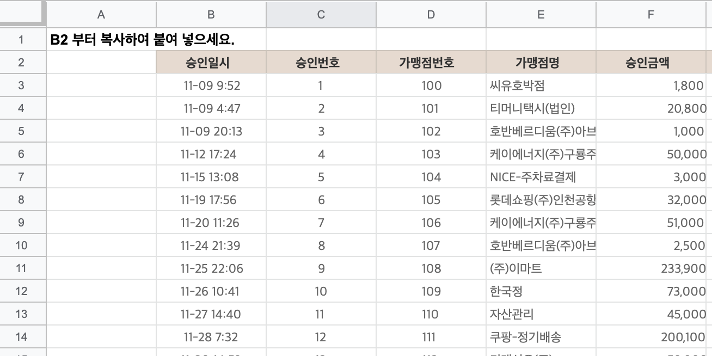
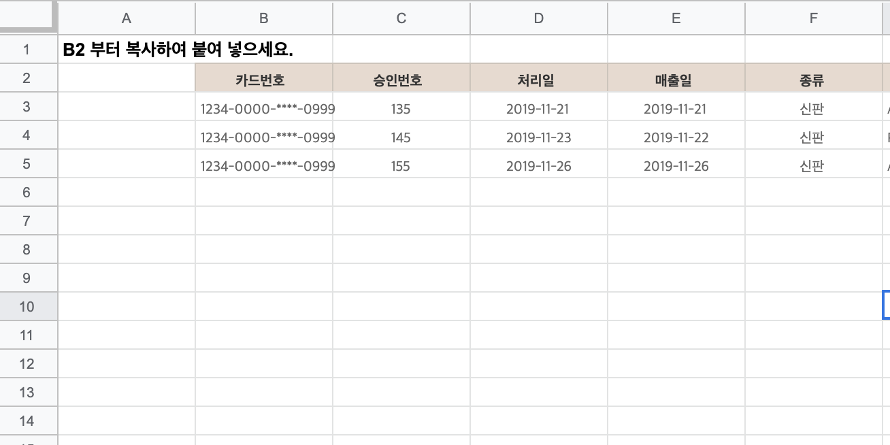
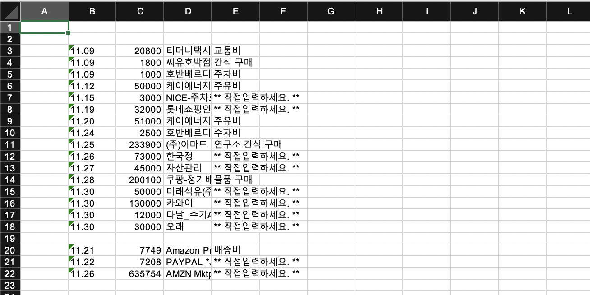

# Excel Automation

* This project's for Handling general Company's Excel jobs.
* 'excel_automation.py' takes 'sample_workbook.xlsx', processes cost for works, and results out to it.

### functions
* close_book
  - save & close the excel work book
* handle_abroad           
  - handle the ibk abroad cost list
* handle_domestic         
  - handle the ibk domestic cost list
* write_records           
  - write cost records to new worksheet
* excel_list 
  - listing up of a designated directory             
* filter_worksheet        
  - filtering what matches conditions out of excel files
* find_checked_excel_list 
  - excel_list & filter_worksheet
* process_excel_costs     
  - results out new worksheet from domestic & abroad records
* draw_barchart           
  - draw barchart from processed worksheet

* Input(Domestic & Abroad Cost list)

* Output(processied total list)

